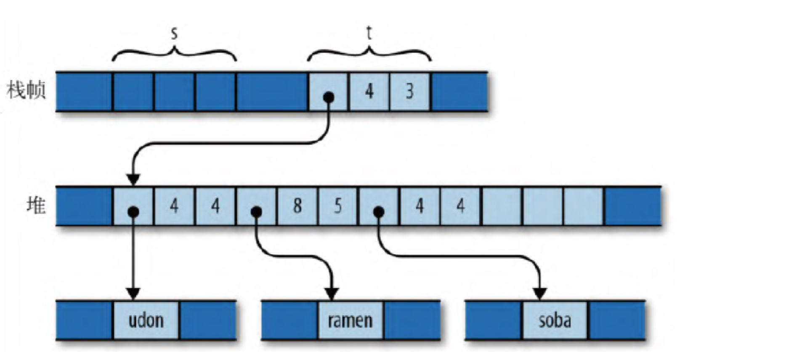

# Move Semantics 所有权和引用

These exercises are adapted from [pnkfelix](https://github.com/pnkfelix)'s [Rust Tutorial](https://pnkfelix.github.io/rust-examples-icfp2014/) -- Thank you Felix!!!

## Further information

For this section, the book links are especially important.

- [Ownership](https://doc.rust-lang.org/book/ch04-01-what-is-ownership.html)
- [Reference and borrowing](https://doc.rust-lang.org/book/ch04-02-references-and-borrowing.html)

# 所有权

## 1 为什么引入所有权

Rust 通过所有权的概念，来保证运行时内存安全和数据竞争的问题。

| 编程语言        | 内存管理方式               | 特点                                                                                   | 缺点                                                       |
| --------------- |----------------------| -------------------------------------------------------------------------------------- |----------------------------------------------------------|
| C/C++           | 手动内存管理 （malloc-free） | 手动控制内存分配与释放，适合高性能应用                                                  | 容易出现悬空指针、内存泄漏等问题——程序员个人导致                                |
| Java/Go/Python  | 自动内存管理（GC）           | 开发者无需关心指针滥用问题，垃圾回收器自动处理内存管理                                  | GC可能导致“Stop The World”现象（ex. jvm运行时占内存），影响性能——例如jvm等自动导致 |
| Rust            | 独特的所有权内存管理方式         | 结合所有权与指针使用约束，接近完美解决内存管理中的悬空指针与内存泄漏问题                | 暂无明显缺点，依赖开发者的理解和使用                                       |

## 2 什么是所有权

来看下面一段示例代码：

```rust
fn print_padovan(){
    let mut padovan = vec![1,1,1]; // 为变量padovan分配值和空间
    // 以下为变量padovan的作用域
    for i in 3..10{ // 3到10
        let next = padovan[i-3] + padovan[i-2];
        padovan.push(next);
    }
    println!("P(1..10) = {:?}",padovan);
    // 作用域结束后清除变量
}
```

其中：

栈帧:（vec容量是动态扩充的，例如容量若是8，现在加入第9个元素，则会自动扩充至16）

| padovan 指针 | 长度 | 容量 |
|------------|------|------|
| 数据的实际地址    |  10  |  16  |

       |
       | 信息栈指向数据堆
       ↓ 

堆:

|   1   |   1   |   1   |   2   |   2   |   3   |   4   |   5   |   7   |   9   |||||||
|-------|-------|-------|-------|-------|-------|-------|-------|-------|-------|-------|-------|-------|-------|-------|-------|


### 总结——Rust 的所有权机制：

#### 所有权的基本概念：
在 Rust 中，每个值都有一个“所有者”（通常是变量），它对这块值（包括内存）的生命周期负责。这个值的所有权在变量声明时被分配，并且在变量离开作用域时，Rust 会自动回收这块内存，避免内存泄漏和其他内存管理问题。

#### 作用域中的所有权：
以 `padovan` 为例，`padovan` 是一个动态数组（`Vec<i32>`），当你在函数内创建它时，Rust 为这个变量分配了两部分内存：

- **栈内存**：栈上存储的是关于 `padovan` 的元数据（如长度、容量和指向堆数据的指针）。
- **堆内存**：堆上存储的是实际的数组数据（即 `padovan` 数组中的各个元素）。

Rust 保证栈和堆上的这些内存区域在 `padovan` 离开作用域时会被自动释放。也就是说，所有权随着 `padovan` 的作用域结束而终止，内存也被清理掉了。

#### 所有权的作用范围：
所有权是与作用域绑定的。在 `padovan` 这个变量的作用域内，它拥有对这片内存（栈和堆）的所有权。当作用域结束时，所有权自动消失，Rust 会自动清理这些内存。这避免了手动管理内存所带来的问题，比如 C/C++ 中的内存泄漏或者悬空指针。

## 3 所有权转移
### 1） 赋值所有权转移

若有如下代码：

```rust
let s = vec!["udon".to_string(), "ramen".to_string(), "soba".to_string()];
let t = s;
let u = s;
```

而字符串数组不同于数字数组，会有两层堆结构，如下图所示：


即第一层栈帧和其他类型一样，是向量s的信息栈。第二层堆作为了字符串“向量”的信息栈，真正的字符串数据存储在了第三层堆。

这在其他语言中是没问题的，但是在rust中会报错。因为一开始，整片空间的所有权是s，但是在`let t = s;`之后，空间的所有权变成了t，s已经被驱逐，如下图所示：



报错出现在第三句`let u = s;`，因为相当于s已经被释放，所以不存在了。所以解决方案是`let t = s.clone();`（深拷贝），这会令`t=s的复制`，s本身不会动，t是新克隆的，数据也会复制一份新的。

### 2）隐式所有权转移

来看代码：

```rust
struct Person{
    name: String,
    brith: i32
}

let mut people = Vec::new();
people.push(
    Person{
        name: "abc".to_String(),
        birth: 15
});
```

这里实际上是隐式地把Person的所有权转移给了people。

### 3）控制流所有权转移

来看代码：

```rust
let x = vec![10,20,30];
if condition(){
    f(x);
}else{
    g(x);
}
// 以上是没有问题的，因为实际上仅会进入一条分支。

h(x); // 这里会报错，因为刚刚进入分支之后，x的所有权会转移给f或g中任意一个函数，此时x相当于不存在了，这里调用会报错。
```

同样的，循环体内也会有所有权转移问题

```rust
let x = vec![10,20,30];
while condition(){
    f(x);  // 这里会报错，因为在第一次进入循环体时，x的所有权就被转移了，第二次开始调用x时会报错。
}
```

### 总结

在rust中，**几乎所有使用值的地方，都会涉及所有权转移**。

## 4 所有权的例外——Copy类型

之前我们碰到的都是有数组特征的类型，现在我们对比一下简单数据类型，如整数、浮点数、布尔值等。

```rust
let str1 = "somnambulance".to_string();
let str2 = str1;

let num1: i32 = 36;
ler num2 = num1;
```

之后的内存情况如下图所示：


这种非链式存储的单体数据类型，拷贝的开销非常小，所以我们会得到上图的结果。我们可以说，所有权，一般不适用于非数组特征的数据类型。

## 5 共享所有权

用于解决所有权机制过于严苛的问题。

```rust
let s: Rc<String> = Rc::new("shirataki".to_string());
let t: Rc<String> = s.clone();  // 并没有克隆数据，而是增加了一份指针，并且计数器++
let u: Rc<String> = s.clone();
```

Rc是一种智能指针，用于在单线程环境下实现共享所有权。
- 每当你克隆一个 Rc<T>，计数器增加1；每当一个引用超出作用域，计数器减少1
- 当引用计数变为 0 时，Rc<T> 会自动释放数据。

内存分配如下图所示：


首先，s被克隆给了t和u，所以它们共享了同一块数据。 其次，堆中的 "shirataki" 字符串只有在最后一个 Rc（即 s、t 或 u）超出作用域后，才会被释放。

此外，多线程环境下需要使用Arc，它是使用原子操作实现的线程安全计数器。

# 引用（借用）

若我们只想访问rust的元素，而不想改变其所有权，那我们便需要引用。

```rust
fn show(t: HashMap<i32, &str>){
    for (key, value) in t {
        println!("key={}, value={}",key,value);
    }
}

let mut t = HashMap::new();
t.insert(12, "a");
t.insert(43, "a");
t.insert(11, "a");

show(t);  // t的所有权转移给了show函数，此时相当于t已经不存在了
```

如果我们再进行：`let val = t.get(&1);`则会报错。因为所有权已经进行转移。

所以，我们引入引用，使得所有权不转移：

```rust
fn show(t: &HashMap<i32, &str>){
    for (key, value) in t {
        println!("key={}, value={}",key,value);
    }
}

let mut t = HashMap::new();
t.insert(12, "a");
t.insert(43, "a");
t.insert(11, "a");

show(&t); // 此时仅访问，不转移所有权

let val = t.get(&1); // 此时不会报错，因为t还存在。 
```

## 引用的分类

- 共享引用（只读）：`&T`，可以有多个共享引用。
- 可变引用（读写）：`&mut T`，同一作用域中只能有一个可变引用。

## 对引用变量进行赋值

来看代码：

```rust
let x = 10;
let y = 20;

let mut r = &x;  // 可变绑定的共享引用，不可以修改x，但是可以改变r的指向
r = &y;

// *r = 20
```

效果如下图所示：


## 引用的引用

套娃：

```rust
struct Point {
    x: i32,
    y: i32
}

let point = Point {x: 12, y: 22};
let r = &point;
let rr = &r;

// rr.x = 12
```

## 引用的安全性

**Rust中的引用永不空**，不会像C/C++等出现空指针的情况。

如何保证？看如下代码：

```rust
let r;
{
    let x = 1;
    r = &x;
}
assert_eq!(*r,1); // 报错，因为x超出了作用域已死（被释放），r现在无法指向x（空指针）
```

我们可以这么解决：

```rust
let r;
{
    let x = 1;
    r = &x;
    assert_eq!(*r,1);
}

```

其次，如下这种情况也会出现问题：

```rust
fn f(p: &'static i32){...}  // 函数f接收一个生命周期为 'static 的引用，静态变量生命周期是全局的，不是作用域的

let x = 10;
f(&x);  // 报错，因为x不是static变量，生命周期和函数生命的不匹配。
```

以上情况可以改为：

```rust
fn f(p: &'a i32){...}  // 'a 是作用域级的生命周期

let x = 10;
f(&x); 
```